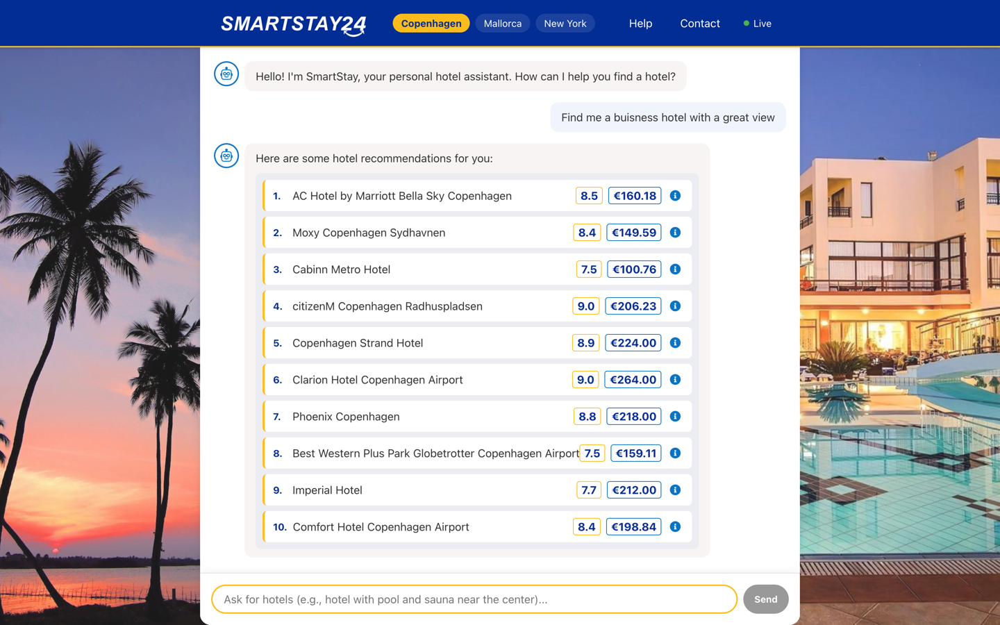
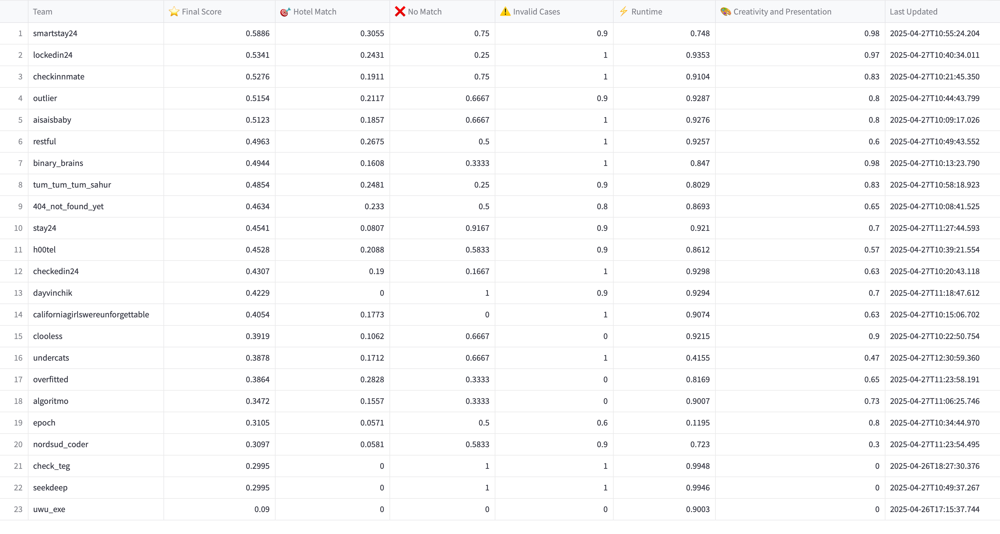
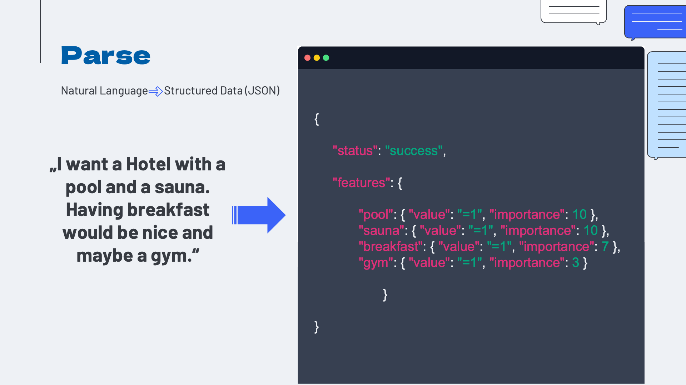
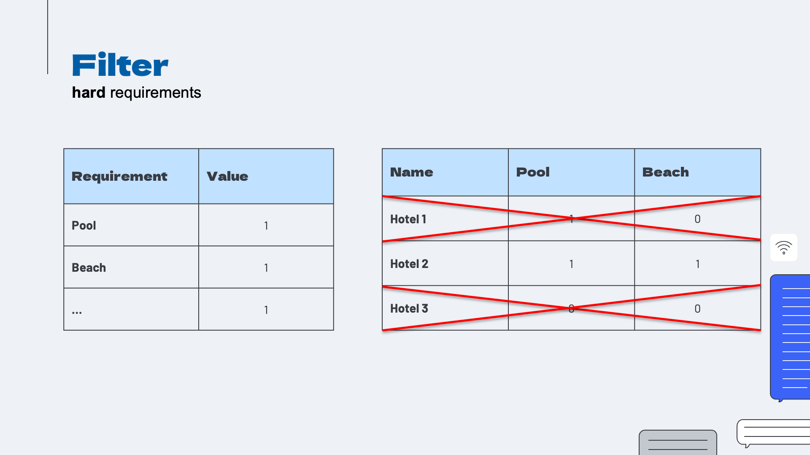
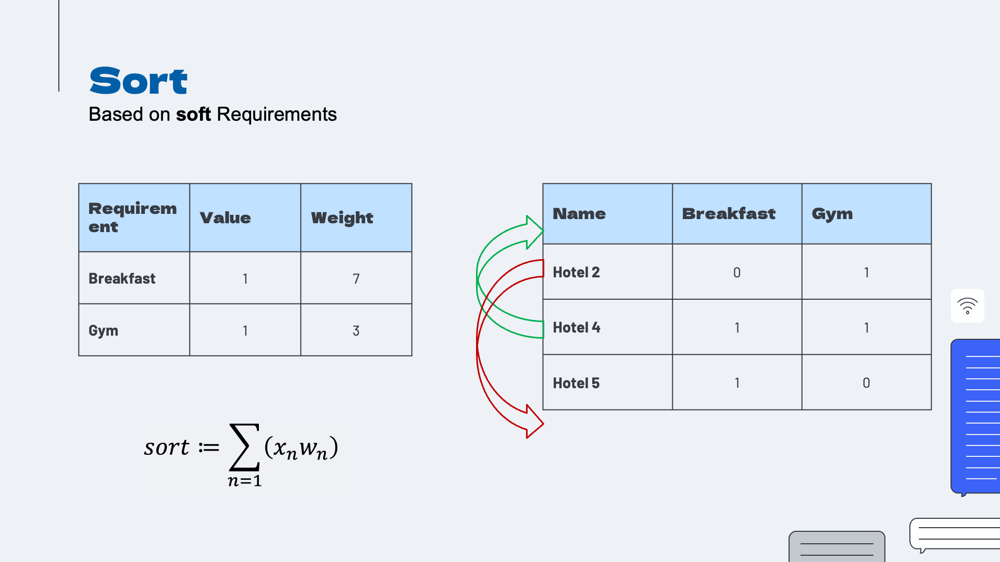
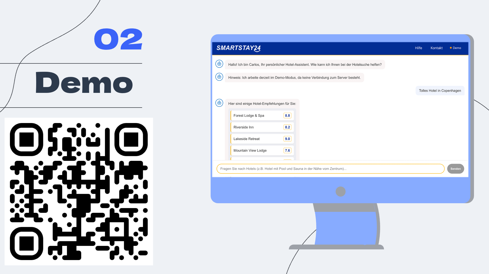

# SmartStay24 🏨🔍 - AI-Powered Hotel Recommendation System


#### 🥇 Winner of the CHECK24 AI Makeathon 2025 Challenge!
Out of 32 competing teams at the [AI Makeathon](https://makeathon.tum-ai.com) (April 25–27, 2025), we proudly secured 1st place and had the incredible opportunity to pitch SmartStay24 in front of over 500 participants!

Inspired by the challenges in modern travel booking, we proudly present SmartStay24—an intelligent hotel recommendation system developed for the CHECK24 AI Makeathon Challenge that understands natural language queries, extracts user preferences, and provides personalized hotel recommendations.

Try it out: https://smart-stay24.de/



---

## Problem Statement

Finding the perfect hotel that meets all of a traveler's needs is often challenging:

- **Natural Language Understanding**: Traditional booking systems struggle to understand complex, conversational requests
- **Preference Prioritization**: Distinguishing between must-have features and nice-to-have amenities
- **Personalized Recommendations**: Providing relevant options based on individual preferences rather than generic listings

Our mission was to design an algorithm that could:
- Parse natural language queries into structured data
- Filter hotels based on non-negotiable requirements
- Sort and rank remaining options based on weighted preferences
- Present users with the most relevant hotel options

---

## Project Highlights

- Handles three distinct types of user queries:
  1. Prompts with fully or partially matching hotels
  2. Prompts with no matching hotels
  3. Irrelevant prompts outside the hotel domain
  
- Optimized for both accuracy and performance:
  - 70% of scoring based on recommendation precision
  - 10% based on response time
  - 20% based on creativity and presentation



---

## How It Works


SmartStay24 operates in three main stages:

### 1. Parse 🗣️➡️🧩
- Transforms natural language commands into structured data (JSON)
- Identifies key features and assigns importance weights
- Distinguishes between hard requirements and soft preferences



### 2. Filter ⚙️
- Eliminates hotels that don't meet critical "hard" requirements
- Creates a shortlist of viable options that satisfy the must-have criteria



### 3. Sort 📊
- Ranks remaining hotels based on weighted soft requirements
- Uses a scoring formula that factors in preference importance
- Returns a maximum of 10 hotels in descending order of relevance



---

## Key Features

- **Natural Language Processing**: Understands conversational queries without requiring specific formatting
- **Multi-City Support**: Works with hotel databases from Copenhagen, Mallorca, and New York
- **Weighted Preference Model**: Distinguishes between essential features and nice-to-have amenities
- **Intelligent Ranking**: Uses a sophisticated algorithm to provide the most relevant recommendations first
- **User-Friendly Interface**: Presents results in a clean, easy-to-understand format

---

## Technology Stack

- **Backend**: Python with NLP capabilities
- **API Integration**: OpenAI models (o3-mini, gpt-4o, gpt-4o mini)
- **Data Processing**: Advanced parsing and filtering algorithms
- **Visualization**: Interactive user interface for demonstration using React

---

## Demo



SmartStay24 features a user-friendly chat interface where users can make natural language requests:

Example: 
> "I'm looking for a hotel with a pool and a sauna. Having breakfast would be nice and maybe a gym."

The system parses this query, identifies the requirements (pool, sauna as high priority; breakfast, gym as lower priority), and returns matching hotels sorted by relevance.

---
## Installation


```bash
# Clone the repository
git clone https://github.com/M4RKUS28/SmartStay24

# Navigate to the project directory
cd SmartStay24

# Install dependencies
pip install -r requirements.txt

# Use function
from code.app import find_matching_hotels

```

---


## Installation and Setup (Frontend + Backend)

```bash
# Clone the repository
git clone https://github.com/M4RKUS28/SmartStay24

# Navigate to the project directory
cd SmartStay24

# Install dependencies
pip install -r requirements.txt
pip install -r backend/requirements.txt

# Create .env file with API_KEY="Google Api Key"

# Run the backend
uvicorn backend.main:app --host 127.0.0.1 --port 8086

# Build the front end

# Change IP to your server IP in client/src/api/hotelService.js
# build client
cd client
npm install
npm run build

# host client and server, redirect /api/to backend with nginx
```

---

## Usage

The core of our system is the `find_matching_hotel()` function that processes queries and returns recommendations:

```python
from smartstay24 import find_matching_hotel

# Example query
query = "I'm looking for a family-friendly hotel that has a nice indoor pool and a relaxing sauna where we can unwind after a long day"

# Get recommendations
results = find_matching_hotel(query)

# Display results
for hotel in results:
    print(f"{hotel.name} - Rating: {hotel.rating}")
```

---

## 🛠️ Contributors

Developed with 🧡 by:

- Paul Vorderbrügge
- Markus Huber
- Luca Bozzetti
- Sebastian Rogg


---

## Acknowledgements

A heartfelt thanks to CHECK24 for organizing this challenge and providing the opportunity to work on such an exciting project!
